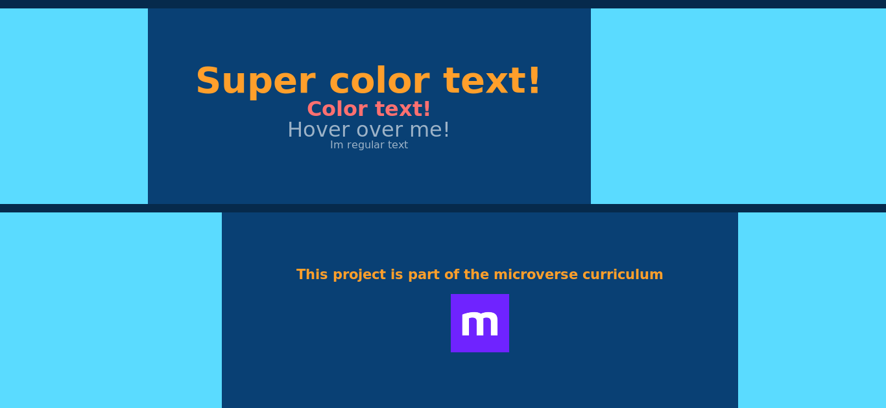

# CSSpaghetti ([The Odin Project](https://www.theodinproject.com/courses/html5-and-css3/lessons/design-your-own-grid-based-framework))

This is the example page for last project([CSSpaghetti](https://github.com/codingAngarita/CSSpaghetti)) of the Main HTML/CSS curriculum at [Microverse](https://www.microverse.org/) - @microverseinc

#### ([Live version]())

#### Live ScreenShot of the page

#### Authors

* [@lilleonz](https://github.com/lilleonz)
* [@codingAngarita](https://github.com/codingAngarita)
